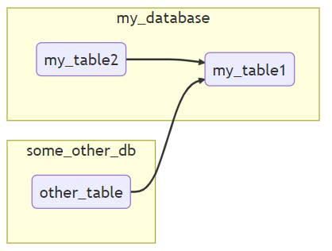

# Introduction

This program reads SQL (more on that bellow) files and generate a diagram of it (also, more on that bellow).

This diagram is generated following the mermaid.js syntax and can be output in two different forms:

1. As simple mermaid.js instructions.
2. As a complete html page that relies on [mermaid.js](https://mermaid.js.org/) javascript module (CDN) to generate a SVG, allong with some other features which you may find [here](https://github.com/Andromelus/mermaid-viewer).

# What it does exactly

The purpose of the program is to view how a table (or multiple) is created. By how, I mean what are the source tables used to populate the target table.

Take the following SQL script (used in the usage section bellow):

```sql
use my_database;
create table my_table1 as
select * from my_table2 
union all select * from some_other_db.other_table;
```

The output of the program will be a diagram (or mermaid instructions) showing the following information:

- There are two databases referenced in the script, ``my_database`` and ``some_other_db``
- The tables ``my_table1`` and ``my_table2`` are located with ``my_database``
- The table ``other_table`` is located within ``some_other_db``
- The tables ``my_database.my_table2`` and ``some_other_db.other_table`` are used to populate ``my_database.my_table1``

For example:



Or, in mermaid syntax:

```
graph LR
subgraph some_other_db
some_other_db.other_table(other_table)
end
subgraph my_database
my_database.my_table1(my_table1)
my_database.my_table2(my_table2)
end
my_database.my_table2-->my_database.my_table1
some_other_db.other_table-->my_database.my_table1
```

You are, obviously, able to tweek the diagram (mermaid instructions) afterwards if necessary. The program goes without much intelligence into the SQL content and generates mermaid instructions without defining if the output order is the most optimized for a "good looking" diagram.

# Supported syntaxes


| Syntax | Supported(version)  | Warning                                                                   |
| ------ | ------------------- | ------------------------------------------------------------------------- |
| HQL    | Most likely (1.1.0) | Nothing (so far)                                                          |
| Impala | Yes (2.12.0)        | X                                                                         |
| TSQL   | A nice chunk of it  | If your script contains CTE(s), this program will output incorrect values |


# Usage

## Clone the project
1. git clone --recurse-submodules https://github.com/Andromelus/sql-to-mermaid-awk.git
2. cd sql-to-mermaid-awk

## Use it

You can pass SQL content in anyway you want (as a file or as STDIN).

### Generate simple mermaid instructions

```bash
$ awk -f main.awk < toto.sql
graph LR
subgraph some_other_db
some_other_db.other_table(other_table)
end
subgraph my_database
my_database.my_table1(my_table1)
my_database.my_table2(my_table2)
end
my_database.my_table2-->my_database.my_table1
some_other_db.other_table-->my_database.my_table1
```


### Generate the html file to directly view the diagram

`awk -v generate_html=1 -f main.awk < toto.sql > result.html`

Note that you can pass any value to the variable `generate_html`. the program only checks if it is an empty string or not.


# Tests

Tests must be launched from repository's root:

```bash 
git clone https://github.com/Andromelus/sql-to-mermaid-awk.git
cd sql-to-mermaid-awk
sh run_tests.sh
```
This program has been tests on:
- ``GAWK 5.0.1``

# Notes about SQL syntax

The program has been initially developped to analyze Impala instructions. However, this is very (very) close to "typical" SQL (Mariadb, MySQL, etc.) syntax, so, unless you do crazy stuff, this program should understand them. If not, please open an issue so it can be fixed.
